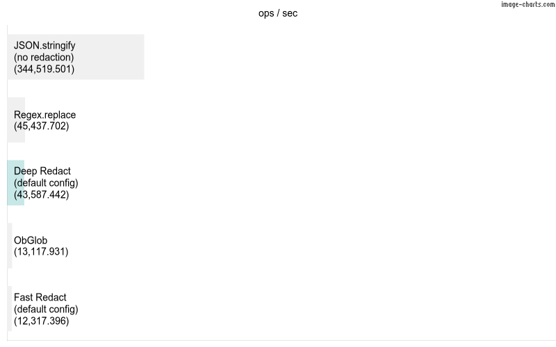

# Deep Redact

Faster than fast-redact <sup>1</sup> as well as being safer and more configurable than many other redaction libraries,
Deep Redact is a zero-dependency tool that redacts sensitive information from strings and objects. It is designed to be
used in a production environment where sensitive information needs to be redacted from logs, error messages, files,
and other outputs.

Circular references and other unsupported are handled gracefully, and the library is designed to be as fast as possible
while still being configurable.

Supporting both CommonJS and ESM, with named and default exports, Deep Redact is designed to be versatile and easy to
use in any modern JavaScript or TypeScript project in Node or the browser.

## Installation

```bash
npm install @hackylabs/deep-redact
```

## Usage

<h4 style="color: red">In order to maintain a consistent usage throughout your project, it is not advised to call this
library outside of your global logging/error-reporting libraries.</h4>

```typescript
// ./src/example.ts
import {DeepRedact} from 'deep-redact'; // If you're using CommonJS, import with require('deep-redact') instead. Both CommonJS and ESM support named and default imports.

const redaction = new DeepRedact({
  replacement: '*',
  replaceStringByLength: true,
  blacklistedKeys: ['password'],
  stringTests: [
    /^[\d]{13,16}$/, // payment card number
    /^[\d]{3,4}$/ // CVV
  ],
});

const obj = {
  password: '<h1><strong>Password</strong></h1>',
  cardNumber: '1234567812345678',
  cvv: '123',
};

redaction.redact(obj) // { password: '**********************************', cardNumber: '****************', cvv: '***' }
```

## Configuration

### Main Options

| key | description | type | options | default | required |
| --- | --- | --- | --- | --- | --- |
| blacklistedKeys | Deeply compare names of these keys against the keys in your object. | array | Array<string￨BlacklistKeyConfig> | [] | N |
| stringTests | Array of regular expressions to perform against string values, whether that value is a flat string or nested within an object. | array | RegExp[] | [] | N |
| fuzzyKeyMatch | Loosely compare key names by checking if the key name of your unredacted object is included anywhere within the name of your blacklisted key. For example, is "pass" (your key) included in "password" (from config). | boolean |  | false | N |
| caseSensitiveKeyMatch | Loosely compare key names by normalising the strings. This involves removing non-word characters and transforms the string to lowercase. This means you never have to worry having to list duplicate keys in different formats such as snake_case, camelCase, PascalCase or any other case. | boolean |  | true | N |
| remove | Determines whether or not to remove the key from the object when it is redacted. | boolean |  | false | N |
| retainStructure | Determines whether or not keep all nested values of a key that is going to be redacted. Circular references are always removed. | boolean |  | false | N |
| replacement | When a value is going to be redacted, what would you like to replace it with? | string |  | [REDACTED] | N |
| replaceStringByLength | When a string value is going to be replaced, optionally replace it by repeating the `replacement` to match the length of the value. For example, if `replaceStringByLength` were set to `true` and `replacement` was set to "x", then redacting "secret" would return "xxxxxx". This is sometimes useful for debugging purposes, although it may be less secure as it could give hints to the original value. | boolean |  | false | N |
| types | JS types (values of `typeof` keyword). Only values with a typeof equal to `string`, `number`, `bigint`, `boolean` or `object` may be redacted. The other types are only listed as options to keep TypeScript happy, so you never need to list them. | array | Array<'string'￨'number'￨'bigint'￨'boolean'￨'symbol'￨'undefined'￨'object'￨'function'> | ['string'] | N |
| serialise | Determines whether or not to serialise the object after redacting. Typical use cases for this are when you want to send it over the network or save to a file, both of which are common use cases for redacting sensitive information. | boolean |  | true | N |
| unsupportedTransformer | When an unsafe value is encountered or a value that cannot be serialised. By default, this function will transform an unsupported value `Unsupported` object. BigInt values are converted a string. Dates are returned using their own `toISOString` method. Regular expressions are returned as objects with their `source` and `flags` values. Errors are converted objects. This is useful when you have a custom class that you would like to redact. For safety reasons, you should always transform a BigInt to avoid JSON.stringify throwing an error. | (value: unknown) => unknown |  | DeepRedact.transformUnsupported | N |

### BlacklistKeyConfig

| key | type | default | required |
| --- | --- | --- | --- |
| key | string￨RegExp |  | Y |
| fuzzyKeyMatch | boolean | Main options `fuzzyKeyMatch` | N |
| caseSensitiveKeyMatch | boolean | Main options `caseSensitiveKeyMatch` | N |
| remove | boolean | Main options `remove` | N |
| retainStructure | boolean | Main options `retainStructure` | N |

### Benchmark
Comparisons are made against JSON.stringify and fast-redact as well as different configurations of deep-redact, using
[this test object](./test/setup/dummyUser.ts). The benchmark is run on a 2021 iMac with an M1 chip with 16GB memory
running Sonoma 14.5.

JSON.stringify is included as a benchmark because it is the fastest way to deeply iterate over an object although it
doesn't redact any sensitive information. Fast-redact is included as a benchmark because it's the next fastest redaction
library available. Neither JSON.stringify nor fast-redact offer the same level of configurability as deep-redact.



| scenario | ops / sec | op duration (ms) | margin of error | sample count |
| --- | --- | --- | --- | --- |
| JSON.stringify, tiny object | 3878848.93 | 0.0002578084 | 0 | 1939425 |
| DeepRedact, default config, tiny object | 1530332.28 | 0.0006534529 | 0.00001 | 765167 |
| JSON.stringify, large object | 295526.11 | 0.0033837958 | 0.00001 | 147764 |
| fast redact, tiny object | 228053.93 | 0.0043849277 | 0.00002 | 114027 |
| DeepRedact, default config, large object | 92714.28 | 0.0107858256 | 0.00006 | 46358 |
| DeepRedact, remove item, single object | 92349.45 | 0.0108284349 | 0.00005 | 46175 |
| DeepRedact, fuzzy matching, single object | 89414.82 | 0.0111838282 | 0.00007 | 44708 |
| DeepRedact, fuzzy and case insensitive matching, single object | 87852.36 | 0.0113827334 | 0.00006 | 43927 |
| DeepRedact, case insensitive matching, single object | 86797.23 | 0.0115211045 | 0.00006 | 43399 |
| DeepRedact, replace string by length, single object | 84150.95 | 0.011883407 | 0.00006 | 42076 |
| DeepRedact, config per key, single object | 71236.85 | 0.0140376786 | 0.00009 | 35619 |
| DeepRedact, retain structure, single object | 69738.86 | 0.0143392076 | 0.00007 | 34870 |
| fast redact, large object | 19480.95 | 0.0513321865 | 0.00038 | 9741 |
| JSON.stringify, 1000 tiny objects | 16003.16 | 0.0624876526 | 0.00017 | 8002 |
| DeepRedact, default config, 1000 tiny objects | 15827.22 | 0.0631822932 | 0.00043 | 7914 |
| DeepRedact, default config, 1000 large objects | 13705.52 | 0.072963285 | 0.00054 | 6853 |
| fast redact, 1000 tiny objects | 7430.88 | 0.1345735164 | 0.00067 | 3716 |
| JSON.stringify, 1000 large objects | 423.52 | 2.3611880519 | 0.00982 | 212 |
| fast redact, 1000 large objects | 77.32 | 12.9327971026 | 0.25939 | 39 |