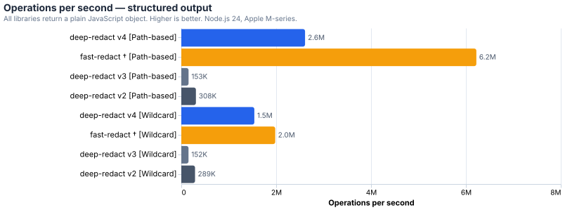
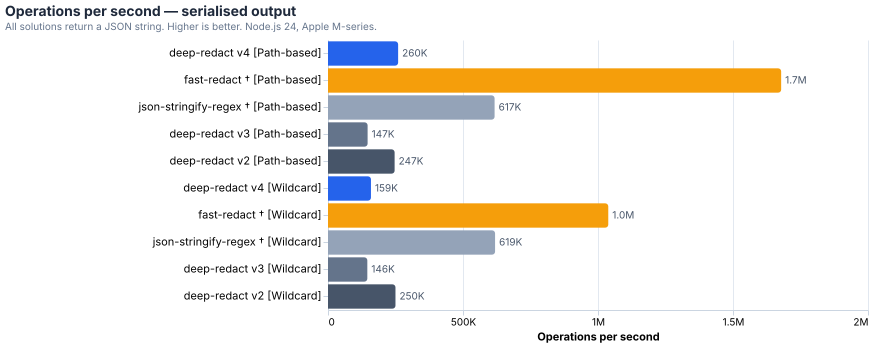

# Deep Redact

[](https://badge.fury.io/js/@hackylabs%2Fdeep-redact)
[](https://github.com/hackylabs/deep-redact/blob/main/LICENSE)

@hackylabs/deep-redact is a rule-driven redaction library for Node.js and Deno. It lets you express what to redact — a key name, a path, a regex, or a substring — and the runtime locates and replaces it everywhere in the payload without requiring exhaustive path enumeration. Policies are compiled once at initialisation and reused across every request, making it suitable for high-throughput production use.

Libraries like `fast-redact` require an explicit path for every location where a sensitive field might appear (`a.b.password`, `a.c.password`, …). Deep Redact inverts this: a single `keys: ['password']` rule targets every `password` field at any depth. It also adds capabilities that path-enumeration libraries cannot offer, such as partial string redaction (targeting a sensitive pattern inside a larger value) and wildcard path selectors for repeated structures.

[](https://ko-fi.com/hackylabs)

## Features

- **Depth-agnostic key rules** — redact any field by name at any nesting depth; no path enumeration required
- **Exact and structured path targeting** — pin redaction to a specific location when precision is needed
- **Regex property matching** — match field names by regular expression
- **Substring targeting** — redact a sensitive string that appears inside a larger value, not just whole-value replacement
- **Wildcard and exclusion path selectors** — handle repeated structures at virtually any depth (`['addresses.*', { ignore: 'country' }]`) without listing every index
- **Structured and serialised output** — return a live object graph or a guaranteed-JSON-safe string (`serialise: true`)
- **Built-in and custom transformers** — override how specific runtime types are represented in serialised output
- **Built-in security** — prevent prototype pollution and DoS by memory exhaustion
- **Console adapter** — optional `console.*` redaction via an explicit adapter

## Contributor Baseline

- Node `24.14.1`
- `pnpm@10.33.0`
- `tsdown`
- `Vitest`
- `ESLint`

## Installation

```sh
npm install @hackylabs/deep-redact
pnpm add @hackylabs/deep-redact
yarn add @hackylabs/deep-redact
bun add @hackylabs/deep-redact
```

**Deno** — add the package to your import map (`deno.json`):

```json
{
  "imports": {
    "@hackylabs/deep-redact": "npm:@hackylabs/deep-redact@4.0.2"
  }
}
```

## Quick Start

```ts
import { deepRedact } from '@hackylabs/deep-redact'

const redact = deepRedact({ keys: ['password', 'token'] })

redact({ user: { password: 'secret', safe: 'keep this' }, token: 'abc123', id: 1 })
// { user: { password: '[REDACTED]', safe: 'keep this' }, token: '[REDACTED]', id: 1 }
```

## Benchmarks

Generated from committed artefacts in `test/artefacts/benchmarks/speed/`. Node.js 24 LTS, Apple M-series. Steady-state after 10,000 warmup iterations.

### TLDR Headline

> **If raw throughput is your primary constraint and you can accept exhaustive path enumeration, use [`fast-redact`](https://www.npmjs.com/package/fast-redact) instead.** It is purpose-built for maximum JSON-string output speed and will outperform any rule-driven library in that narrow scenario. Use Deep Redact when you need depth-agnostic targeting, wildcard paths, substring redaction, or built-in security guarantees.

If you choose fast-redact instead, be aware of the trade-offs:

- **No depth-agnostic key rules** — every sensitive path must be enumerated explicitly
- **No double-wildcard (`**`) path selectors** — you cannot target `records.**.email` without listing every depth
- **No substring targeting** — whole-value replacement only; partial string redaction is not supported
- **No serialisation-safe transformer pipeline** — no built-in handling for `BigInt`, `Date`, `Map`, `Set`, `Error`, `RegExp`, or `URL` values
- **No prototype pollution protection** — no guard against `__proto__` and `constructor.prototype` injection
- **No configurable depth or node limits** — no protection against DoS via deeply nested or excessively large payloads

### Structured output (`serialise: false`)

v4, v3, and fast-redact all return a plain JavaScript object.



_† fast-redact is a third-party library, not a deep-redact version. It is shown as a throughput reference; its feature set and guarantees differ from deep-redact's, so it is not a like-for-like comparison._

v4 is **~15× faster** than v3 on path-based workloads and **~9× faster** on wildcard workloads.

### Serialised output (`serialise: true`)

All four solutions return a JSON string.



_† fast-redact is a third-party library; json-stringify-regex is a naive native approach (`JSON.stringify(value).replace(pattern, replacement)`), not a library. Neither performs deep-redact's structured redaction or offers its guarantees, so both are shown as throughput references rather than like-for-like comparisons._

v4 remains faster than v3 in serialised mode. fast-redact and json-stringify-regex have a throughput advantage because their output path is oriented entirely toward string production.

Against deep-redact v2 the serialised picture is mixed: v4 is roughly at parity on path-based workloads but slower on breadth-heavy (wildcard) ones. That gap is the cost of safety v2 does not provide — under `serialise: true`, v4 runs the type transformers that make `BigInt`, `Date`, `Map`, `Set`, `Error`, `RegExp`, and `URL` values JSON-safe, and it detects and neutralises circular references instead of throwing on them. (Node and depth budgeting via `maxNodes`/`maxDepth` is opt-in and unlimited by default, so it adds nothing unless you enable it.)

These safety passes are intrinsic to `serialise: true` and cannot be switched off individually. If you do not need those guarantees and want to match v2's throughput (or better), set `serialise: false` and run your own `JSON.stringify`: the structured-output path skips the transformer and circular-reference passes entirely. This restores v2's trade-offs too — your `JSON.stringify` will throw on `BigInt` and circular references, `Map`/`Set` serialise as `{}`, and `undefined` is dropped.

Full speed and resource benchmark results: [`docs/benchmarks/speed-results.md`](docs/benchmarks/speed-results.md) and [`docs/benchmarks/resource-results.md`](docs/benchmarks/resource-results.md).

## Configuration

`deepRedact(options)` accepts a single options object. All options are optional.

### Top-level options

| Option | Type | Default | Required | Description |
|--------|------|---------|----------|-------------|
| `keys` | `KeySelector[]` | `[]` | No | Redact any field matching a listed key, at any depth |
| `paths` | `PathEntry[]` | `[]` | No | Redact fields at specific paths; supports exact strings, structured paths, wildcards, and exclusion selectors |
| `stringTests` | `StringTest[]` | `[]` | No | Redact matching patterns inside string values |
| `censor` | `string \| function` | `'[REDACTED]'` | No | Replacement value, or a function `(value, context) => replacement` |
| `serialise` | `boolean \| function` | `false` | No | `true` returns a JSON-safe string; a function receives the safe graph and may return any string |
| `remove` | `boolean` | `false` | No | Remove matched keys from the output instead of replacing their values |
| `retainStructure` | `boolean` | `false` | No | Keep descendant nodes traversable for lower-precedence rules when a parent is matched |
| `replaceStringByLength` | `boolean` | `false` | No | Repeat the `censor` string to match the character length of the redacted value |
| `types` | `ValueTypeName[]` | `['string']` | No | `typeof` categories eligible for redaction; a matched key whose value's type is not listed is left untouched |
| `fuzzyKeyMatch` | `boolean` | `false` | No | Match when the configured key is a substring of the field name (e.g. `'pass'` matches `'password'`) |
| `caseSensitiveKeyMatch` | `boolean` | `true` | No | When `false`, normalises key names (strips non-word characters, lowercases) before comparing |
| `maxDepth` | `number` | unlimited | No | Stop traversal beyond this nesting depth; guards against deeply nested payload DoS |
| `maxNodes` | `number` | unlimited | No | Stop traversal after this many nodes; guards against excessively large payload DoS |
| `transformers` | `TransformersOption` | built-in defaults | No | Override how runtime types are represented in serialised output |
| `diagnostics` | `DiagnosticsOptions` | — | No | Receive a structured event when a value is degraded to `[UNSUPPORTED]` during serialisation |

`ValueTypeName` is one of: `'string'`, `'number'`, `'bigint'`, `'boolean'`, `'object'`, `'function'`, `'symbol'`, `'undefined'`.

### `KeySelector`

Each entry in `keys` may be a plain `string`, a `RegExp`, or a `KeyRule` object for per-key overrides.

`keys` traverses plain objects, arrays, class instances' own enumerable fields, and `Map`/`Set` contents. `Map` entry keys are matched by their rendered string form while preserving the original key object in structured output; `Set` members are traversed in insertion order, but their numeric positions are path segments rather than synthetic keys.

| Field | Type | Default | Required | Description |
|-------|------|---------|----------|-------------|
| `key` | `string \| RegExp` | — | Yes | The key to match |
| `censor` | `string \| function` | top-level `censor` | No | Override the censor for this key only |
| `remove` | `boolean` | top-level `remove` | No | Override remove for this key only |
| `retainStructure` | `boolean` | top-level `retainStructure` | No | Override retainStructure for this key only |
| `replaceStringByLength` | `boolean` | top-level `replaceStringByLength` | No | Override replaceStringByLength for this key only |
| `fuzzyKeyMatch` | `boolean` | top-level `fuzzyKeyMatch` | No | Override fuzzyKeyMatch for this key only |
| `caseSensitiveKeyMatch` | `boolean` | top-level `caseSensitiveKeyMatch` | No | Override caseSensitiveKeyMatch for this key only |

### `PathEntry`

Each entry in `paths` may be a plain dot-notation string (e.g. `'user.profile.ssn'`), a structured path array, or a `PathRule` object for per-path overrides.

Structured path arrays may contain:

| Segment type | Example | Matches |
|---|---|---|
| `string` or `number` | `'password'` | Exact key or index |
| `RegExp` | `/^pass/i` | Keys matching the regex |
| `{ any: true }` | — | Any single key (`*`) |
| `{ anyDepth: true }` | — | Zero or more keys at any depth (`**`) |
| `{ ignore: string \| number \| RegExp }` | `{ ignore: 'country' }` | Excludes a key from a surrounding wildcard |

| Field | Type | Default | Required | Description |
|-------|------|---------|----------|-------------|
| `path` | `string \| PathSegments[]` | — | Yes | The path to match |
| `censor` | `string \| function` | top-level `censor` | No | Override the censor for this path only |
| `remove` | `boolean` | top-level `remove` | No | Override remove for this path only |
| `retainStructure` | `boolean` | top-level `retainStructure` | No | Override retainStructure for this path only |
| `replaceStringByLength` | `boolean` | top-level `replaceStringByLength` | No | Override replaceStringByLength for this path only |

### `StringTest`

Each entry in `stringTests` may be a bare `RegExp` (whole-value replacement with `censor`) or a `SubstringRule` for partial replacement.

| Field | Type | Required | Description |
|-------|------|----------|-------------|
| `pattern` | `RegExp` | Yes | Regular expression tested against string values |
| `replacer` | `(value: string, pattern: RegExp) => string` | Yes | Returns the redacted string; called only when `pattern` matches |

### `TransformersOption`

Transformers control how non-JSON-safe runtime types are represented when `serialise: true`. Each transformer is a function `(value: unknown) => unknown` that either returns a transformed value or returns the value unchanged to pass to the next transformer in the chain.

| Field | Type | Description |
|-------|------|-------------|
| `byType.bigint` | `Transformer[]` | Applied to `BigInt` values (does not consult `byType.object`) |
| `byType.object` | `Transformer[]` | Applied first for built-in constructor types and unknown object types |
| `byConstructor.Date` | `Transformer[]` | Applied to `Date` instances |
| `byConstructor.Error` | `Transformer[]` | Applied to `Error` instances |
| `byConstructor.Map` | `Transformer[]` | Applied to `Map` instances |
| `byConstructor.RegExp` | `Transformer[]` | Applied to `RegExp` instances |
| `byConstructor.Set` | `Transformer[]` | Applied to `Set` instances |
| `byConstructor.URL` | `Transformer[]` | Applied to `URL` instances |
| `byConstructor.custom` | `CustomConstructorTransformerRegistration[]` | Custom types matched by `instanceof` in declaration order |
| `fallback` | `Transformer[]` | Applied when no earlier transformer returns a changed value |

The built-in transformers produce deterministic marker objects (e.g. `{ _transformer: 'date', datetime: '<ISO string>' }`). See [`docs/architecture/serialise-output.md`](docs/architecture/serialise-output.md) for the full dispatch order and marker shapes.

### `DiagnosticsOptions`

| Field | Type | Description |
|-------|------|-------------|
| `sink` | `(event: DiagnosticEvent) => void` | Called with a structured event when a value is degraded to `'[UNSUPPORTED]'` during serialisation |

## Public API

```ts
import { createRedactor, deepRedact } from '@hackylabs/deep-redact'

// deepRedact and createRedactor are the same factory under different names
const redact = deepRedact({ keys: ['secret'] })
const same = createRedactor({ keys: ['secret'] })
```

## Documentation

### Worked examples

- [Key targeting](docs/examples/key-targeting.md)
- [Fuzzy and case-insensitive key matching](docs/examples/fuzzy-key-matching.md)
- [Path targeting](docs/examples/path-targeting.md)
- [Wildcard path segments and ignore selectors](docs/examples/path-segment-ignore.md)
- [Regex property matching](docs/examples/regex-property-matching.md)
- [Per-key rule overrides](docs/examples/per-key-rule-overrides-string.md)
- [Substring targeting](docs/examples/substring-targeting.md)
- [Replacement and removal](docs/examples/replacement-and-removal.md)
- [Structured vs serialised output](docs/examples/serialised-output.md)
- [Custom transformers](docs/examples/custom-transformer.md)
- [Value-type allowlist](docs/examples/value-type-allowlist-default.md)
- [Singleton / service-root setup](docs/examples/singleton-setup.md)
- [Console redaction adapter](docs/examples/console-redaction.md)

### Migration guides

- [Migrating from Deep Redact v3](docs/migration/from-v3.md)
- [Migrating from fast-redact](docs/migration/from-fast-redact.md)

### Architecture and design

- [Rule precedence and evaluation order](docs/architecture/precedence.md)
- [Serialised output: transformer dispatch and marker shapes](docs/architecture/serialise-output.md)
- [One-way redaction contract](docs/architecture/one-way-redaction.md)

### Platform and security teams

- [Standardisation guide](docs/platform/standardisation-guide.md) — supported capabilities, targeting semantics, verification evidence, and adoption decision scope

## Scripts

- `pnpm run build`
- `pnpm run lint`
- `pnpm run test`
- `pnpm run generate-exports`
- `pnpm run generate-readme`
- `pnpm run verify-generated-files`
- `pnpm run bench`
- `pnpm run bench:generate-charts`
